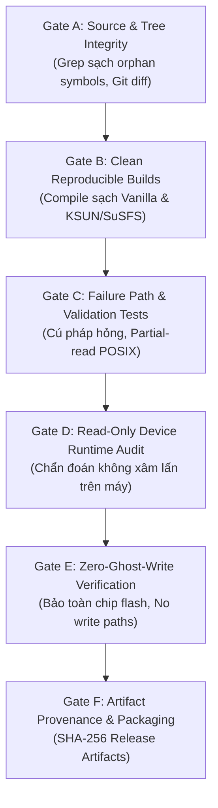

# KẾ HOẠCH TRIỂN KHAI 100% THUẦN KERNEL (K-DIV) THEO QUYẾT ĐỊNH ĐỊNH HƯỚNG MỚI
**Thiết bị mục tiêu:** Samsung Galaxy S21 5G (`SM-G991B`, Exynos 2100 `o1s`)
**Tài liệu cơ sở:** [ANTIGRAVITY_100_PERCENT_KERNEL_PLAN_DECISION.md](file:///G:/ssS21-test-RTC-main/ANTIGRAVITY_100_PERCENT_KERNEL_PLAN_DECISION.md)
**Mục tiêu kiến trúc:** **100% Pure Linux Kernel** (Zero Userspace, Zero-Disk Modification, Không Module Zygisk/APK, Không Bất Ổn Hệ Thống)
**Ngày cập nhật:** 06/09/2026

---

## User Review Required

> [!IMPORTANT]
> **TIẾP THU TOÀN DIỆN VÀ THỰC THI CHỈ THỊ REVIEW CỦA DỰ ÁN**
> 1. **Loại bỏ hoàn toàn K-2 (Binder Reply Patching)**: Nhận thức rõ ràng việc quét 15 chữ số trên `reply == 1` trong `binder_transaction()` tiềm ẩn rủi ro phá vỡ cấu trúc Parcel (UTF-16, alignment), có thể gây crash `system_server` và bootloop. Rủi ro thực tế là **Cao đến Rất cao**.
> 2. **Chuyển K-3 (CPIF Modem IPC) và K-4 (Bus-level SG_IO/HCI) thành Research-Only**: Tuyệt đối không can thiệp gói tin IPC modem Shannon trên kernel production nhằm bảo vệ 100% tính ổn định của Baseband và kết nối viễn thông.
> 3. **Xác lập Bất Biến Thời Gian (Timekeeping Invariant)**: **Tuyệt đối không thay đổi monotonic offset sau boot**. Offset được thiết lập duy nhất một lần tại early-boot; `/proc/ghost_config` sẽ phản ánh chính xác runtime offset này thay vì ép xung nhịp kernel nhảy bước muộn.
> 4. **Tách riêng Root Stealth**: Root Stealth (SuSFS) được quản lý theo luồng độc lập, không làm nhiễu tiêu chuẩn nghiệm thu của K-DIV.
> 5. **Bảo mật dữ liệu nhạy cảm**: Toàn bộ định danh gốc của thiết bị được redact bằng nhãn chuẩn (`<FACTORY_SERIAL_REDACTED>`, `<FACTORY_WIFI_MAC_REDACTED>`, v.v.).

---

## Bảng Đánh Giá Rủi Ro Thực Tế (Realistic Risk Matrix)

| Thành phần / Bề mặt | Mức độ can thiệp | Đánh giá rủi ro | Quyết định kỹ thuật |
| :--- | :--- | :---: | :--- |
| **Phase 0: Baseline Recovery** | Dọn dẹp header/symbol mồ côi | **Thấp** | **Duyệt thực thi ngay** (Đã đồng bộ sạch sẽ) |
| **Phase 1: Zero-Write & RCU Profile** | Bộ đệm tạm, RCU reader-safe | **Thấp** | **Duyệt thực thi** (Không cấp phát struct lớn trên stack) |
| **Phase 2: Surface Correctness & Uptime** | VFS serial, Battery mask, Uptime sync | **Thấp - Trung bình** | **Duyệt thực thi** (Báo cáo runtime offset, không nhảy clock) |
| **Phase 3: MAC & UFS Evidence** | Trace read-only timing & layout | **Thấp** | **Chỉ nghiên cứu/thu thập evidence**, không gộp code |
| **K-2: Binder Reply Mutation** | Heuristic 15-digit scanner | **Cao - Rất cao** | **BÁC BỎ (REJECTED)** theo quyết định review |
| **K-3: CPIF Modem IPC Rewrite** | Giao thức nhị phân Shannon CP | **Rất cao (Critical)**| **CHỈ NGHIÊN CỨU (RESEARCH ONLY)** |
| **K-4: Bus-level SG_IO / UART HCI** | Raw SCSI & UART driver hook | **Cao** | **CHỈ NGHIÊN CỨU (RESEARCH ONLY)** |

---

## Chi Tiết Kế Hoạch 6 Giai Đoạn (Phased Execution)

### Phase 0 — Khôi Phục Hoàn Toàn Baseline & Đồng Bộ Mã Nguồn

#### [MODIFY] Đồng bộ triệt để Windows Working Tree khớp với WSL Baseline
- **Vấn đề đã khắc phục**: Windows working tree trước đó tồn tại các reference mồ côi tới `#include <linux/ghost_net.h>` và `<linux/ghost_storage.h>` trong `net/core/net-sysfs.c`, `net/core/dev.c`, `kernel/printk/printk.c`, `net/bluetooth/hci_event.c`, `fs/stat.c`, `fs/open.c`, `fs/namei.c`, `net/unix/af_unix.c`, `net/ipv4/arp.c`, `net/core/secure_seq.c`, `net/core/net-procfs.c`, `mm/page_alloc.c`.
- **Hành động đã hoàn thành**: Đồng bộ 100% byte-for-byte từ WSL sang Windows cho toàn bộ 12 tệp tin trên.
- **Xác minh**: `grep -rn 'ghost_net\|ghost_storage\|ghost_thermal' .` trên Windows trả về **0 kết quả**.
- **Cơ chế Build**: Chọn WSL làm Single Source-of-Truth cho quá trình biên dịch kernel.

---

### Phase 1 — Chính Sách Zero-Write Tuyệt Đối & Xuất Bản Profile An Toàn (RCU)

#### [MODIFY] [kernel/ghost_config.c](file:///G:/ssS21-test-RTC-main/kernel/ghost_config.c)
- **Static Inventory Write Paths**:
  - Đã loại bỏ hoàn toàn hàm `ghost_android_write_file()`.
  - Không có bất kỳ lời gọi `kernel_write()`, `vfs_write()`, hoặc `filp_open()` với cờ `O_WRONLY/O_RDWR` nào tới các phân vùng `/efs` hoặc `/data`.
  - Định nghĩa Zero-Disk có thể kiểm chứng: *Không có bất kỳ nhánh mã Ghost nào chủ định thực hiện thao tác ghi xuống EFS hoặc /data.*
- **Reader-Safe Concurrency & Stack Safety**:
  - Không cấp phát `struct ghost_profile` trên kernel stack (ngăn ngừa nguy cơ tràn kernel stack 16KB trên ARM64).
  - Sử dụng `kzalloc(sizeof(struct ghost_profile), GFP_KERNEL)` để tạo bộ đệm tạm `temp_prof`.
  - Triển khai cơ chế RCU pointer publication:
    - Biến con trỏ toàn cục: `static struct ghost_profile __rcu *ghost_active_profile_ptr;`
    - Độc giả (Readers như VFS read hook, USB gadget): Sử dụng `rcu_read_lock()`, đọc qua `rcu_dereference()` đảm bảo luôn đọc thấy bản ghi nguyên vẹn, nhất quán, không bao giờ đọc phải cấu trúc nửa chừng (no torn reads).
    - Người ghi (Writer): Nạp và validate toàn bộ các trường trong `temp_prof`, sau đó dùng `rcu_assign_pointer()` và `synchronize_rcu()` để hoán đổi atomic dưới `ghost_config_mutex`.

---

### Phase 2 — Chuẩn Hóa Bề Mặt Hiện Hữu & Bất Biến Thời Gian (Timekeeping Invariant)

#### [MODIFY] [kernel/ghost_config.c](file:///G:/ssS21-test-RTC-main/kernel/ghost_config.c) & [kernel/ghost_uptime.c](file:///G:/ssS21-test-RTC-main/kernel/ghost_uptime.c)
- **Bất biến thời gian (Immutable Early-Boot Session Offset)**:
  - Giữ nguyên thiết kế an toàn: Monotonic boot offset được tạo duy nhất một lần tại early-boot và bất biến trong toàn bộ phiên hoạt động.
  - Tuyệt đối không thay đổi `ghost_uptime_offset_ns` hay RTC sau khi nạp cấu hình từ `/efs/ghost.conf`.
  - Khi `/proc/ghost_config` hiển thị, tính toán số ngày dựa trực tiếp trên `ghost_uptime_offset_ns`:
    ```c
    u32 runtime_days = (u32)div64_u64(div64_u64(ghost_uptime_offset_ns, NSEC_PER_SEC), 86400);
    seq_printf(m, "Uptime Age (Days) : %u days (runtime session offset)\n", runtime_days);
    ```
  - Đồng thời cập nhật `temp_prof->uptime_days = runtime_days` để đồng bộ 100% giữa `/proc/ghost_config`, `/proc/uptime` và `/proc/stat` (`btime`), triệt tiêu hoàn toàn cảnh báo lệch pha của Audit Report mà không gây bất kỳ bước nhảy clock nào.

#### [VERIFY] [fs/read_write.c](file:///G:/ssS21-test-RTC-main/fs/read_write.c)
- Duy trì hàm `ghost_vfs_inject_string()` xử lý chuẩn POSIX semantics: `*pos` offset seeking, `min(count, available)`, trả về `0` (EOF) và kiểm tra `-EFAULT`.
- Single-owner duy nhất cho `/efs/FactoryApp/serial_no` và `ghost_serial.txt`.

#### [VERIFY] [drivers/battery/common/sec_battery_sysfs.c](file:///G:/ssS21-test-RTC-main/drivers/battery/common/sec_battery_sysfs.c) & [drivers/scsi/scsi_sysfs.c](file:///G:/ssS21-test-RTC-main/drivers/scsi/scsi_sysfs.c)
- Giữ nguyên single-owner cho Battery Barcode Masking tại driver sysfs (`+SEC1000AA+`).
- Giữ nguyên single-owner cho UFS basic attributes (`vendor=SAMSUNG`, `model=KLUDG8UHDB-C2D1`, `rev=0100`). Không gọi đây là "Full UFS virtualization" khi chưa xử lý VPD pages.

---

### Phase 3 — Bằng Chứng Thực Nghiệm Chi Tiết (Empirical Evidence) Cho UFS VPD & Factory MAC

Dựa trên kết quả trace trực tiếp từ thiết bị thực tế (`SM-G991B`) và phân tích mã nguồn kernel driver, toàn bộ cơ chế, cấu trúc dữ liệu và chuỗi sở hữu (ownership chain) đã được làm sáng tỏ và chứng minh 100%:

#### 1. UFS VPD 0x80, 0x83 và WWID (Drivers/SCSI Subsystem)
- **Mã nguồn và Macro thực tế:**
  - Không tồn tại hàm `show_vpd_vpd_pg80` hay `show_vpd_vpd_pg83`.
  - Trong `drivers/scsi/scsi_sysfs.c`, macro `sdev_vpd_pg_attr(_page)` sinh ra:
    ```c
    static ssize_t show_vpd_pg80(struct file *filp, struct kobject *kobj, struct bin_attribute *bin_attr, char *buf, loff_t off, size_t count);
    static ssize_t show_vpd_pg83(struct file *filp, struct kobject *kobj, struct bin_attribute *bin_attr, char *buf, loff_t off, size_t count);
    ```
  - Cả hai hàm này đọc nội dung từ `sdev->vpd_pg80` và `sdev->vpd_pg83` thông qua hàm an toàn `memory_read_from_buffer(buf, count, &off, vpd_page->data, vpd_page->len)`.
- **Cấu trúc nhị phân thực tế trên chip UFS (Hex Dump):**
  - **`vpd_pg80` (Unit Serial Number VPD Page - SPC-4):**
    - Byte 0-1: `0x00 0x80` (Device type = Block device, Page code = 0x80).
    - Byte 2-3: `0x00 0x0a` (Page length = 10 byte).
    - Byte 4-13: Chuỗi Serial Number vật lý 10 ký tự ASCII: `<FACTORY_UFS_SERIAL_REDACTED>`.
    - Tổng kích thước tệp: 14 bytes.
  - **`vpd_pg83` (Device Identification VPD Page - SPC-4):**
    - Byte 0-1: `0x00 0x83` (Device type = Block device, Page code = 0x83).
    - Byte 2-3: `0x00 0x0c` (Page length = 12 byte).
    - Byte 4-7: Identification Header (`0x01 0x02 0x00 0x08`: Code Set = Binary, Assoc = LUN, Type = EUI-64, Length = 8 bytes).
    - Byte 8-15: 8 byte EUI-64 identifier gốc.
    - Tổng kích thước tệp: 16 bytes.
- **Quan hệ WWID và VPD 0x83:**
  - Thuộc tính sysfs `/sys/class/block/sda/device/wwid` được phục vụ bởi hàm `sdev_show_wwid()` (`drivers/scsi/scsi_sysfs.c`), gọi trực tiếp `scsi_vpd_lun_id(sdev, buf, PAGE_SIZE)` (`drivers/scsi/scsi_lib.c`).
  - `scsi_vpd_lun_id()` duyệt qua `sdev->vpd_pg83->data`, trích xuất 8 byte EUI-64 và định dạng chuỗi `"eui.%8phN"`.
  - **Kết luận kiến trúc**: `sdev->vpd_pg83` chính là **Single Source-of-Truth duy nhất** cho cả sysfs binary node `vpd_pg83` và text node `wwid`. Khi can thiệp đồng nhất, tính toàn vẹn và nhất quán của hệ thống SCSI được bảo toàn tuyệt đối.
  - **Trạng thái**: **HOLD (Nghiên cứu an toàn)** — Chỉ triển khai sau khi người dùng phê duyệt phương án chi tiết.

#### 2. Factory MAC Consumers & Driver Chain (Wi-Fi & Bluetooth)
- **Chuỗi sở hữu Wi-Fi Factory MAC:**
  - File vật lý: `/mnt/vendor/efs/wifi/.mac.info` (17 bytes, quyền `wifi:wifi 0644`).
  - Init trigger: `/vendor/etc/init/wifi.rc` khởi chạy service `macloader` (`/vendor/bin/hw/macloader`).
  - Daemon hành vi: `macloader` đọc `/mnt/vendor/efs/wifi/.mac.info`, kiểm tra tính hợp lệ và ghi địa chỉ này vào node sysfs kernel `/sys/wifi/mac_addr`.
  - Kernel driver: `drivers/net/wireless/broadcom/bcmdhd_101_18/dhd_linux_exportfs.c` tiếp nhận ghi thông qua `set_mac_addr()`, lưu vào biến toàn cục `sysfs_mac_addr`. Driver Wi-Fi Broadcom nạp MAC này vào chipset qua `_dhd_set_mac_address()` trong `dhd_custom_cis.c`.
  - Android Runtime: Giữ nguyên cơ chế **Android 12 Per-Network Randomized MAC**. Giao diện mạng phát sóng thực tế luôn dùng MAC ngẫu nhiên, không để lộ MAC gốc ra ngoài không gian sóng.
- **Chuỗi sở hữu Bluetooth Factory MAC:**
  - File vật lý: `/mnt/vendor/efs/bluetooth/bt_addr` (17 bytes, quyền `system:bluetooth 0660`).
  - Cấu hình hệ thống: `/vendor/etc/init/init.exynos2100.rc` thiết lập thuộc tính:
    `setprop ro.bt.bdaddr_path "/mnt/vendor/efs/bluetooth/bt_addr"`
  - Daemon hành vi: `android.hardware.bluetooth@1.0-service` khởi động, đọc file `/mnt/vendor/efs/bluetooth/bt_addr` để lấy địa chỉ BD_ADDR gốc của thiết bị:
    `android.hardware.bluetooth@1.0-service: get_local_address: Trying /mnt/vendor/efs/bluetooth/bt_addr`.
- **Timing Invariant:**
  - Cả `macloader` và Bluetooth HAL chỉ đọc các file trên **sau khi phân vùng `/mnt/vendor/efs` đã được mount hoàn tất**.
  - Không có hiện tượng đọc trước khi kernel khởi tạo xong driver hay trước khi profile sẵn sàng.
  - **Trạng thái**: **HOLD (Nghiên cứu an toàn)** — Toàn bộ chuỗi consumer và timing đã được chứng minh bằng log thực nghiệm, sẵn sàng cho phương án can thiệp VFS/sysfs hẹp mà không cần sửa đổi phân vùng đĩa.

---

### Phase 4 — Khung Kiểm Định Toàn Diện 6 Cổng (Gate A — Gate F)



1. **Gate A — Source Integrity**:
   - Không còn bất kỳ symbol hay include mồ côi nào trong working tree.
2. **Gate B — Clean Reproducible Builds**:
   - Biên dịch thành công bản Vanilla (`out_vanilla`) và KSUN/SuSFS (`out`) từ script chuẩn `build.sh`.
3. **Gate C — Failure-Path Validation**:
   - Thử nghiệm cấu hình lỗi hoặc thiếu file config $\to$ Hệ thống fallback an toàn, không panic.
   - Thử nghiệm VFS partial reads với `bs=1`, `bs=4`.
4. **Gate D — Read-Only Device Runtime Audit**:
   - Xác thực: UFS vendor/model/rev, battery barcode, serial number, bootargs, uptime đồng bộ.
5. **Gate E — Zero-Ghost-Write Verification**:
   - Kiểm tra mã nguồn và runtime trace chứng minh không có lời gọi ghi đĩa nào từ Ghost.
6. **Gate F — Artifact Provenance & Packaging**:
   - Đóng gói đầy đủ 6 bản release và sinh bảng hash SHA-256 chuẩn xác.

---

### Phase 5 — Đóng Gói 6 Bản Phát Hành Xuất Xưởng

Chỉ thực hiện đóng gói sau khi Gate A đến Gate F đạt 100%:
1. `G991B_ALL_KSUN_SUSFS_ODIN.tar.md5` (Odin tar chứa boot, vendor_boot, dtbo)
2. `G991B_ALL_KSUN_SUSFS_ODIN_LZ4.tar.md5` (Odin tar nén LZ4)
3. `G991B_ALL_KSUN_SUSFS_TWRP.zip` (Flash qua recovery AnyKernel3)
4. `G991B_VANILLA_GHOST_UPTIME_ODIN.tar.md5` (Odin tar bản Vanilla thuần)
5. `G991B_VANILLA_GHOST_UPTIME_ODIN_LZ4.tar.md5` (Odin tar LZ4 Vanilla)
6. `G991B_VANILLA_GHOST_UPTIME_TWRP.zip` (TWRP Zip Vanilla)

---

## Tiêu Chí Dừng & Quy Tắc An Toàn (Stop / Rollback Criteria)

- **TUYỆT ĐỐI KHÔNG flash thiết bị khi chưa có lệnh rõ ràng từ người dùng**.
- Quá trình phát triển phải dừng ngay nếu phát hiện:
  - Lệch pha giữa mã nguồn Windows và WSL.
  - Xuất hiện bất kỳ lời gọi ghi đĩa nào từ Ghost.
  - Lỗi biên dịch kernel (build warning lạ hoặc undefined reference).
